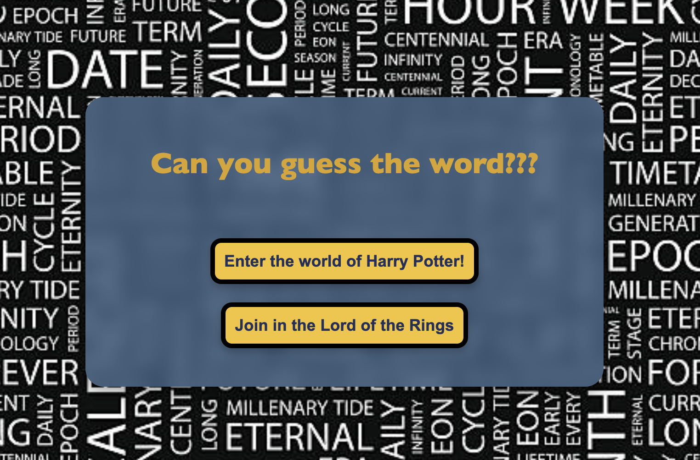
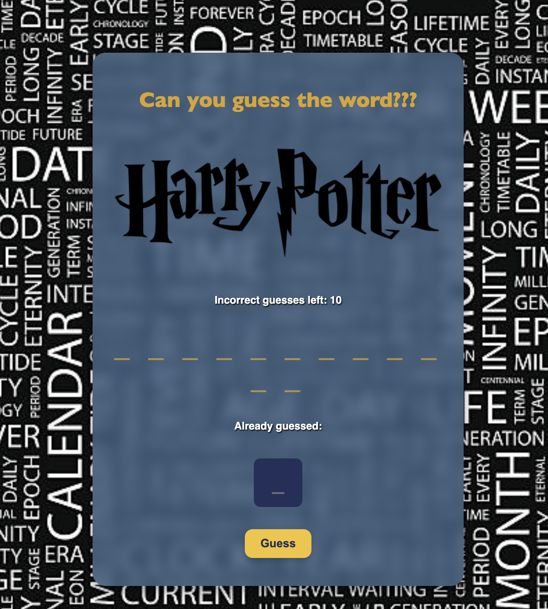
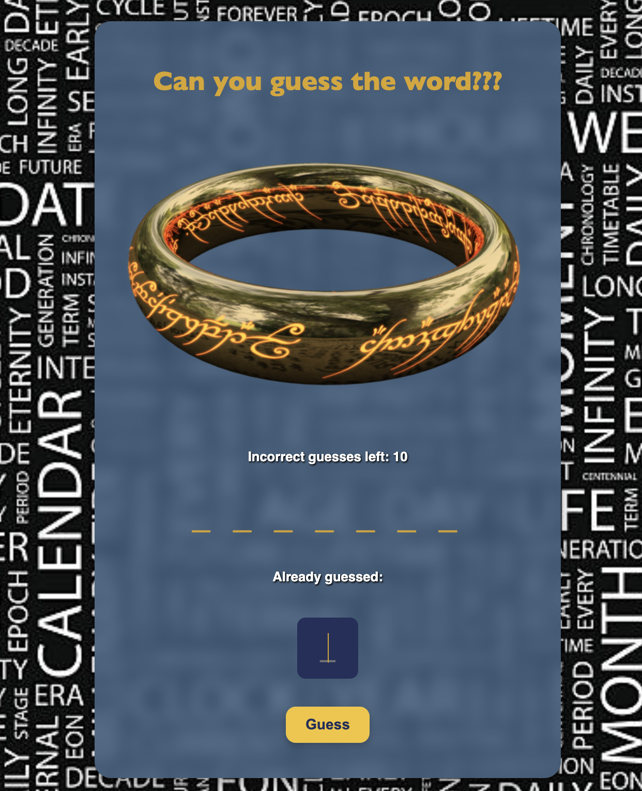

# Guess the themed word game
## A themed word-guessing game filled with Harry Potter spells and Lord of he Rings characters; you choose which one you want to play!

Start by entering the world of magic and test your spell knowledge. Or follow us into the Shire and see how many LotR characters you remember!

**_Can you guess the words before you run out of guesses?_**

### Attributions/ Citations
**Images** 

>HP Logo and the One Ring courtesy of [WikimediaCommons][link]

[link]:https://commons.wikimedia.org/wiki/File:Harry_Potter_wordmark.svg

>Background from [iStock][link].

[link]:https://www.istockphoto.com/

**Colors**

> Thematic colors from [Color-Hex][site]

[site]: https://www.istockphoto.com/

### Technologies Used
* Javascript
     * Arrays 
     * Conditions *(if statements)*
     * Loops
     * Iterator Methods
     * DOM
* CSS
    * Flexbox
    * Responsive Design
*  Markup *(HTML)*
* Markdown *(this)*

### Next Steps
* Post MVP, more themes will be added to allow players to select the universe of choice, like **Starwars** and **MCU**. 
* More animations will be addded to match each theme. 
* Light and dark modes for more adaptive play.  
* Mobile friendly version.
